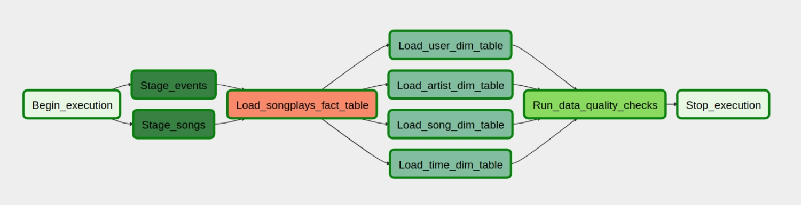

# Building a robust data pipeline with Apache Airflow

## The purpose of the process with respect to the Sparkify business

The purpose is to design an ELT batch process that allows moving the sparkify data, currently stored as JSON-files on a remote S3 bucket, efficiently to a Redshift
database where it is transformed into a star schema and used for analysis of user behaviour and preferences.

It should be noted that the process first loads the data to Redshift and then transforms it. It therefore is an EXTRACT LOAD TRANSFORM (ELT) process.

***

## The starting point

The raw data is contained in two folders in json-format on an S3 bucket.  

* Songs data are stored in individual files ordered alphabetically where each file contains only one song record.
* Log data are contained in a separate folder partitoned by year and then month, where each file represents an entire month's worth of logs of user activity.

***

## The DAG

The DAG (directed acyclic graph) is made up of four stages:

* In the first stage data from the two bucket locations is written in parallel to Redshift. As the two steps are running concurrently the overall process is considerably sped up as compared to copying the two folders one after the other.
* In the second step the data in the staging tables is combined to produce the central fact table of the star schema
* In the third step the smaller dimension tables are copied over from the staging tables and the central **songplays** fact table. This again happens in paralllel to save time.
* In the fourth and final step the tables of the star schema are checked for containing actual data and any missing values in the primary key columns.

## Implementation details

The S3 to Redshift copy operator allows the specification of a json_path file that gives more felxibility in case the 'auto' option does not give the desired results.

The SQL-statements given in the **sql_queries.py** file are dynamically combined with the name of the destination table. Instead of the given SQL statement other strings containing SQL commands could be used and combined with the name of the destination table.

The operators that produce the staging tables and the dimension tables allow for either append-only and delete-load functionality, by giving the option to delete all the previous records from the destination table before writting new records.

The database name on the Redshift cluster will usually be taken from the database connection hook. However, the operators also allow to change the name of the database from the DAG file directly. In this case the settings from the hook are overriden.

The data quality checking step allows for both single columns or list of columns to be checked for each individual table. The names of the tables and columns is not hard-coded and can be easily manipulated in the central DAG file.
